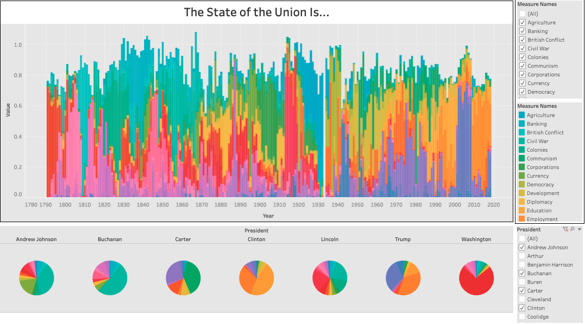

# state-of-union-NLP
**Using natural language processing and unsupervised learning to dive into and compare State of the Unions from Washington to Trump**

In this repo you will find the following files:
* My powerpoint presentation](https://github.com/S-DeFerrari/State-of-Union-NLP/blob/main/The%20State%20of%20the%20Union%20Is....pdf) on this project going over each step of the process as well as my results. This is the best place to start. 
* The original [CSV file](https://github.com/S-DeFerrari/State-of-Union-NLP/blob/main/NLP_Full.csv) I used for this project.
* The [jupyter notebook](https://github.com/S-DeFerrari/State-of-Union-NLP/blob/main/NLP_Full.ipynb) I used for this project

[The date](https://www.kaggle.com/rtatman/state-of-the-union-corpus-1989-2017) for this project comes from Kaggle.com.

## Tableau Dashboard

Please take a look at the [dashboard](https://public.tableau.com/profile/stephen.deferrari#!/vizhome/Project4_15979585299720/Dashboard1) I made for this project. It lets you compare and contrast different issues and presidents across U.S. history. 
